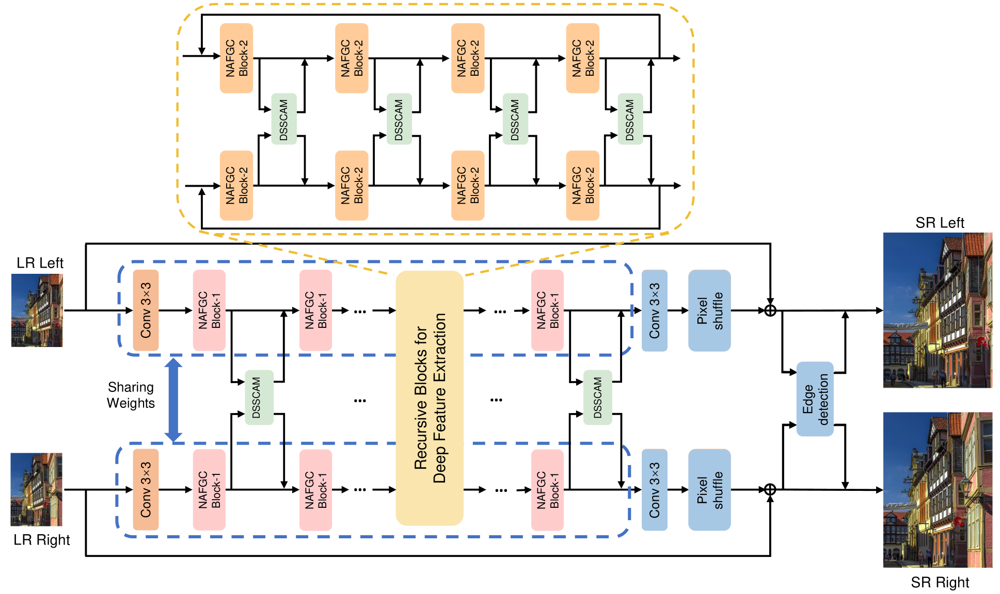
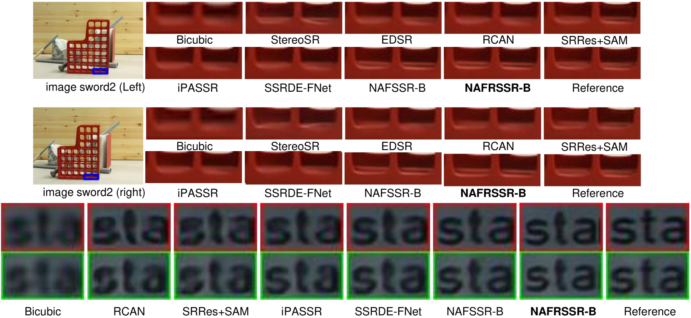
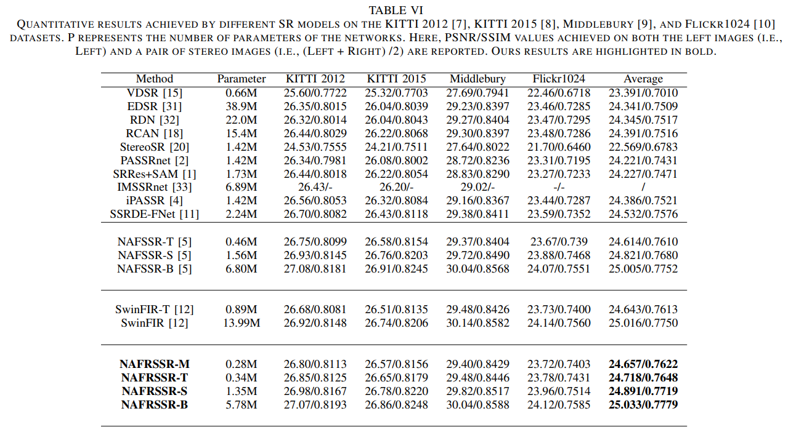

# NAFRSSR: a Lightweight Recursive Network for Efficient Stereo Image Super-Resolution
[Read our paper on ArXiv](https://arxiv.org/abs/2405.08423)
## Introduction
Stereo image super-resolution (SR) refers to the reconstruction of a high-resolution (HR) image from a pair of low-resolution (LR) images as typically captured by a dual-camera device. To enhance the quality of SR images, most previous studies focused on increasing the number and size of feature maps and introducing complex and computationally intensive structures, resulting in models with high computational complexity. Here, we propose a simple yet efficient stereo image SR model called NAFRSSR, which is modified from the previous state-of-the-art model NAFSSR by introducing recursive connections and lightweighting the constituent modules. Our NAFRSSR model is composed of nonlinear activation free and group convolution-based blocks (NAFGCBlocks) and depth-separated stereo cross attention modules (DSSCAMs). The NAFGCBlock improves feature extraction and reduces number of parameters by removing the simple channel attention mechanism from NAFBlock and using group convolution. The DSSCAM enhances feature fusion and reduces number of parameters by replacing 1x1 pointwise convolution in SCAM with weight-shared 3x3 depthwise convolution. Besides, we propose to incorporate trainable edge detection operator into NAFRSSR to further improve the model performance. Four variants of NAFRSSR with different sizes, namely, NAFRSSR-Mobile (NAFRSSR-M), NAFRSSR-Tiny (NAFRSSR-T), NAFRSSR-Super (NAFRSSR-S) and NAFRSSR-Base (NAFRSSR-B) are designed, and they all exhibit fewer parameters, higher PSNR/SSIM, and faster speed than the previous state-of-the-art models. In particular, to the best of our knowledge, NAFRSSR-M is the lightest (0.28M parameters) and fastest (50 ms inference time) model achieving an average PSNR/SSIM as high as 24.657 dB/0.7622 on the benchmark datasets. 

### 
### 
### 
### 


## Requirements
The required environment for the project is consistent with NAFSSR (https://github.com/megvii-research/NAFNet/blob/main/docs/StereoSR.md).  More details will be updated at a later time.


This project was inspired by and makes use of the excellent NAFSSR.
If you find our work useful in your research or publications, please consider citing:
```latex
@misc{chen2024nafrssr,
      title={NAFRSSR: a Lightweight Recursive Network for Efficient Stereo Image Super-Resolution}, 
      author={Yihong Chen and Zhen Fan and Shuai Dong and Zhiwei Chen and Wenjie Li and Minghui Qin and Min Zeng and Xubing Lu and Guofu Zhou and Xingsen Gao and Jun-Ming Liu},
      year={2024},
      eprint={2405.08423},
      archivePrefix={arXiv},
      primaryClass={eess.IV}
}
```
